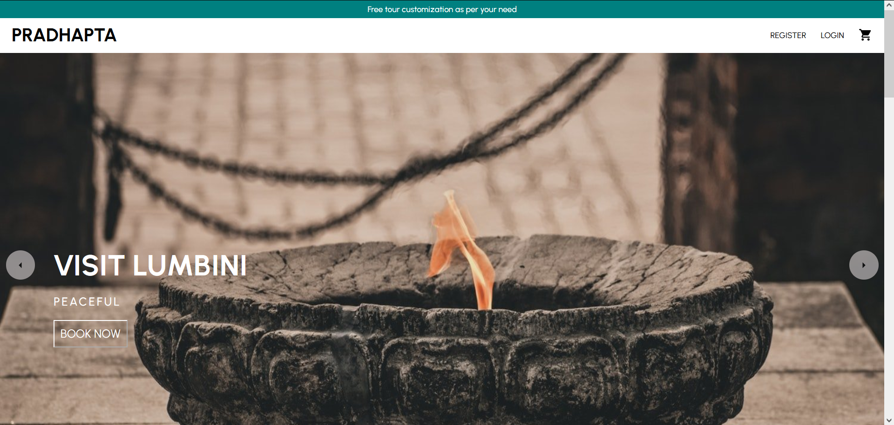

# Pradhapta Tours

Pradhapta Tours is a full stack web application built using React.js,Redux and Node.js/Express.

## Live Demo

Try the application live at https://pradhapta-tours.netlify.app/

## API Docs

You can use the REST API to create calls to get the data you need

https://documenter.getpostman.com/view/16210167/UVJWpf7x

## Technologies Used

- React.js
- Redux
- Node.js
- Express
- Mongo DB
- Mongoose
- HTML5
- CSS3
- Material UI
- Heroku
- Rest API
- Stripe

## Features

- User can view a list of tours
- User can view a tour's details
- User can book tours to their shopping cart
- User can view shopping cart
- User can checkout and place an order
- User can login and view their tours

## Preview

## TODO

- Make it mobile responsive
- Add protected routes
